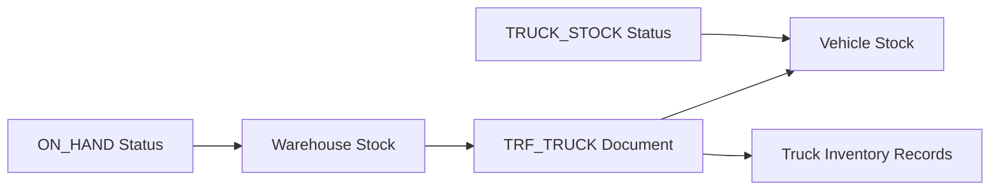
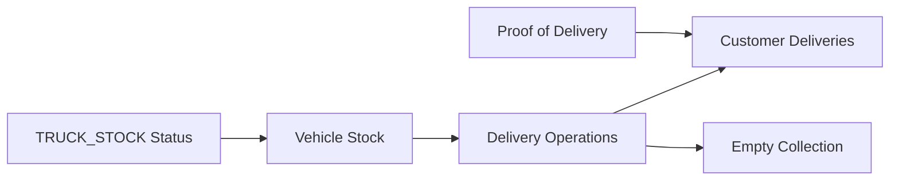
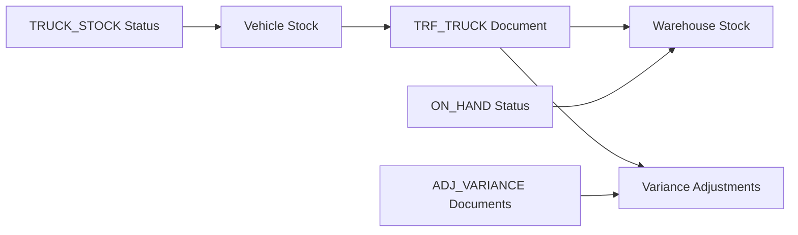

# Vehicle as Warehouse Implementation

## 🚚 Overview

This implementation treats **vehicles as mobile warehouses** during trips, allowing the system to track inventory that moves from physical warehouses to vehicles and back. This is a crucial business logic that enables:

- **Real-time inventory tracking** across all locations (warehouses + vehicles)
- **Proper stock movements** with audit trails
- **Capacity validation** for both weight and volume
- **Variance handling** when unloading vehicles
- **Complete inventory visibility** throughout the delivery process

## 🏗️ Architecture

### Core Concept

When a driver is in a vehicle with inventory, the vehicle becomes a **mobile warehouse** with its own stock levels. The system tracks:

1. **Warehouse Inventory** (`ON_HAND` status) - Physical warehouse stock
2. **Vehicle Inventory** (`TRUCK_STOCK` status) - Inventory loaded on vehicles
3. **Stock Movements** - Transfers between warehouses and vehicles

### Database Design

#### Enhanced Vehicle Model
```sql
ALTER TABLE vehicles ADD COLUMN capacity_m3 NUMERIC(10, 2);
ALTER TABLE vehicles ADD COLUMN volume_unit VARCHAR(10) DEFAULT 'm3';
```

#### New Tables
- **`truck_inventory`** - Trip-specific inventory tracking
- **`deliveries`** - Delivery records with proof of delivery
- **`delivery_lines`** - Individual product deliveries

#### Stock Level Integration
- Vehicles are treated as warehouses in the `stock_levels` table
- `TRUCK_STOCK` status tracks vehicle inventory
- `TRF_TRUCK` document type handles warehouse ↔ vehicle transfers

## 🔄 Business Workflow

### 1. Vehicle Loading (Warehouse → Vehicle)



**Process:**
1. **Capacity Validation** - Check weight/volume limits
2. **Stock Document Creation** - `TRF_TRUCK` from warehouse to vehicle
3. **Stock Level Updates** - Decrease warehouse, increase vehicle
4. **Truck Inventory Records** - Trip-specific tracking

### 2. Trip Execution (Vehicle as Warehouse)



**Process:**
1. **Real-time Inventory** - Vehicle stock available for deliveries
2. **Flexible Quantities** - Adjust delivery amounts based on customer needs
3. **Empty Collection** - Track empty cylinders returned
4. **Proof of Delivery** - Signatures, photos, GPS location

### 3. Vehicle Unloading (Vehicle → Warehouse)



**Process:**
1. **Actual vs Expected** - Compare loaded vs unloaded inventory
2. **Variance Calculation** - Identify differences and reasons
3. **Stock Document Creation** - `TRF_TRUCK` from vehicle to warehouse
4. **Variance Adjustments** - `ADJ_VARIANCE` documents for differences

## 🛠️ Implementation Components

### 1. VehicleWarehouseService

**Core service for vehicle-as-warehouse operations:**

```python
class VehicleWarehouseService:
    async def load_vehicle_as_warehouse(
        self,
        vehicle_id: UUID,
        trip_id: UUID,
        source_warehouse_id: UUID,
        inventory_items: List[Dict[str, Any]],
        loaded_by: UUID
    ) -> Dict[str, Any]:
        """
        Load vehicle with inventory, treating it as a mobile warehouse
        """
```

**Key Methods:**
- `load_vehicle_as_warehouse()` - Load inventory from warehouse to vehicle
- `unload_vehicle_as_warehouse()` - Unload inventory from vehicle to warehouse
- `get_vehicle_inventory_as_warehouse()` - Get current vehicle inventory
- `validate_vehicle_capacity()` - Check weight/volume capacity

### 2. Database Models

#### TruckInventoryModel
```python
class TruckInventoryModel(Base):
    __tablename__ = "truck_inventory"
    
    trip_id: Mapped[UUID]
    vehicle_id: Mapped[UUID]
    product_id: Mapped[UUID]
    variant_id: Mapped[UUID]
    loaded_qty: Mapped[Decimal]
    delivered_qty: Mapped[Decimal]
    empties_collected_qty: Mapped[Decimal]
    empties_expected_qty: Mapped[Decimal]
```

#### DeliveryModel
```python
class DeliveryModel(Base):
    __tablename__ = "deliveries"
    
    trip_id: Mapped[UUID]
    order_id: Mapped[UUID]
    customer_id: Mapped[UUID]
    status: Mapped[DeliveryStatus]
    customer_signature: Mapped[Optional[str]]
    photos: Mapped[Optional[List[str]]]
    gps_location: Mapped[Optional[str]]
```

### 3. API Endpoints

#### Load Vehicle as Warehouse
```http
POST /vehicles/{vehicle_id}/load-as-warehouse
{
  "trip_id": "uuid",
  "source_warehouse_id": "uuid",
  "vehicle": { /* vehicle object */ },
  "inventory_items": [
    {
      "product_id": "uuid",
      "variant_id": "uuid",
      "quantity": 10.0,
      "unit_weight_kg": 15.5,
      "unit_volume_m3": 0.05
    }
  ]
}
```

#### Unload Vehicle as Warehouse
```http
POST /vehicles/{vehicle_id}/unload-as-warehouse
{
  "trip_id": "uuid",
  "destination_warehouse_id": "uuid",
  "actual_inventory": [ /* actual items found */ ],
  "expected_inventory": [ /* expected items */ ]
}
```

#### Get Vehicle Inventory
```http
GET /vehicles/{vehicle_id}/inventory-as-warehouse?trip_id={trip_id}
```

## 📊 Stock Movement Tracking

### Stock Document Types

1. **`TRF_TRUCK`** - Transfers between warehouses and vehicles
   - `TRF-TRUCK-LOAD-{trip_id}-{timestamp}` - Warehouse → Vehicle
   - `TRF-TRUCK-UNLOAD-{trip_id}-{timestamp}` - Vehicle → Warehouse

2. **`ADJ_VARIANCE`** - Variance adjustments during unloading
   - `ADJ-VAR-{trip_id}-{variant_id}-{timestamp}` - Inventory differences

### Stock Status Flow

```
Warehouse (ON_HAND) ←→ Vehicle (TRUCK_STOCK)
     ↑                        ↑
  Physical                Mobile
 Warehouse               Warehouse
```

### Inventory Visibility

**Real-time inventory across all locations:**
- **Warehouse Stock** - `stock_levels` with `ON_HAND` status
- **Vehicle Stock** - `stock_levels` with `TRUCK_STOCK` status
- **Trip Inventory** - `truck_inventory` for trip-specific tracking
- **Delivery Records** - `deliveries` for customer delivery history

## 🔍 Capacity Management

### Weight Capacity
- **Validation** - Check total weight against `vehicle.capacity_kg`
- **Utilization** - Calculate weight utilization percentage
- **Warnings** - Alert when utilization > 90%

### Volume Capacity
- **Validation** - Check total volume against `vehicle.capacity_m3`
- **Utilization** - Calculate volume utilization percentage
- **Flexible Units** - Support for m³, ft³, etc.

### Capacity Validation Response
```json
{
  "is_valid": true,
  "weight_kg": 1250.5,
  "volume_m3": 8.75,
  "weight_capacity_kg": 2000.0,
  "volume_capacity_m3": 12.0,
  "weight_utilization_pct": 62.5,
  "volume_utilization_pct": 72.9,
  "warnings": ["High volume utilization: 72.9%"]
}
```

## 📈 Variance Handling

### Variance Detection
```python
def _calculate_inventory_variances(
    self,
    actual_inventory: List[Dict[str, Any]],
    expected_inventory: List[Dict[str, Any]]
) -> List[Dict[str, Any]]:
    """
    Calculate variances between expected and actual inventory
    """
```

### Variance Types
1. **Quantity Variances** - Different amounts than expected
2. **Missing Items** - Items not found on vehicle
3. **Extra Items** - Items not expected on vehicle
4. **Damage/Loss** - Items damaged or lost during trip

### Variance Adjustment Process
1. **Calculate Differences** - Compare actual vs expected
2. **Create Adjustment Documents** - `ADJ_VARIANCE` for each variance
3. **Update Stock Levels** - Reflect actual inventory
4. **Audit Trail** - Complete documentation of variances

## 🎯 Business Benefits

### 1. **Complete Inventory Visibility**
- Real-time stock levels across all locations
- No "black holes" in inventory tracking
- Full audit trail from warehouse to customer

### 2. **Accurate Stock Movements**
- Proper warehouse ↔ vehicle transfers
- Variance detection and handling
- Cost tracking throughout the process

### 3. **Capacity Optimization**
- Weight and volume validation
- Utilization monitoring
- Overload prevention

### 4. **Operational Efficiency**
- Mobile warehouse concept
- Flexible delivery quantities
- Proof of delivery tracking

### 5. **Financial Control**
- Accurate inventory valuation
- Variance investigation
- Cost allocation to trips

## 🔧 Integration Points

### 1. **Stock Level Service**
- Vehicle treated as warehouse in stock levels
- `TRUCK_STOCK` status for vehicle inventory
- Real-time stock level updates

### 2. **Stock Document Service**
- `TRF_TRUCK` documents for transfers
- `ADJ_VARIANCE` documents for variances
- Complete audit trail

### 3. **Trip Service**
- Trip-specific inventory tracking
- Delivery record creation
- Trip completion with variance handling

### 4. **Order Service**
- Order fulfillment from vehicle inventory
- Delivery quantity adjustments
- Customer delivery tracking

## 🚀 Usage Examples

### Example 1: Load Vehicle for Trip
```python
# Load vehicle with inventory
result = await vehicle_warehouse_service.load_vehicle_as_warehouse(
    vehicle_id=vehicle_id,
    trip_id=trip_id,
    source_warehouse_id=warehouse_id,
    inventory_items=[
        {
            "product_id": "prod-123",
            "variant_id": "var-456",
            "quantity": 50.0,
            "unit_weight_kg": 15.5,
            "unit_volume_m3": 0.05
        }
    ],
    loaded_by=driver_id
)
```

### Example 2: Get Vehicle Inventory
```python
# Get current vehicle inventory
inventory = await vehicle_warehouse_service.get_vehicle_inventory_as_warehouse(
    vehicle_id=vehicle_id,
    trip_id=trip_id
)
```

### Example 3: Unload Vehicle with Variances
```python
# Unload vehicle and handle variances
result = await vehicle_warehouse_service.unload_vehicle_as_warehouse(
    vehicle_id=vehicle_id,
    trip_id=trip_id,
    destination_warehouse_id=warehouse_id,
    actual_inventory=actual_items,
    expected_inventory=expected_items,
    unloaded_by=driver_id
)
```

## 📋 Migration Steps

### 1. **Database Migration**
```bash
# Run the migration
psql -d your_database -f migrations/011_create_truck_inventory_and_deliveries_tables.sql
```

### 2. **Update Vehicle Records**
```sql
-- Add volume capacity to existing vehicles
UPDATE vehicles SET capacity_m3 = 12.0, volume_unit = 'm3' WHERE capacity_m3 IS NULL;
```

### 3. **Service Integration**
- Add `VehicleWarehouseService` to dependency injection
- Update trip loading/unloading processes
- Integrate with existing stock level service

## 🎉 Conclusion

The **Vehicle as Warehouse** implementation provides:

✅ **Complete inventory tracking** across warehouses and vehicles  
✅ **Proper stock movements** with full audit trails  
✅ **Capacity validation** for weight and volume  
✅ **Variance handling** with adjustment documents  
✅ **Real-time visibility** of all inventory locations  
✅ **Mobile warehouse concept** for delivery operations  

This implementation transforms vehicles into **mobile warehouses** that seamlessly integrate with the existing inventory management system, providing complete visibility and control over inventory throughout the delivery process. 